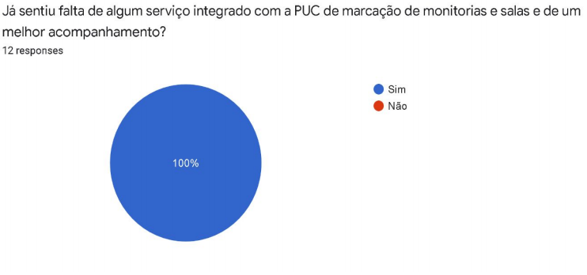
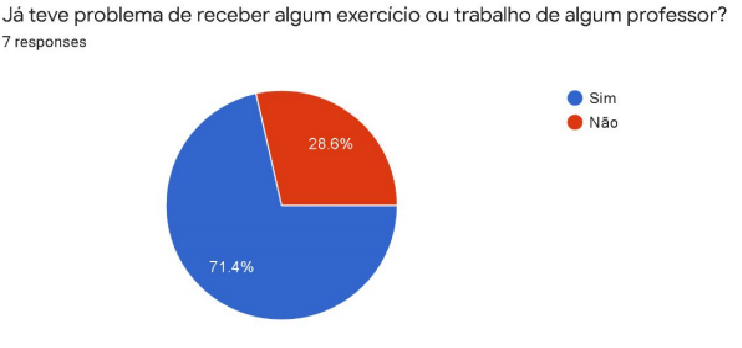
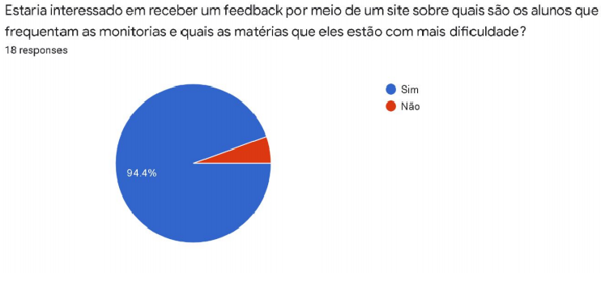
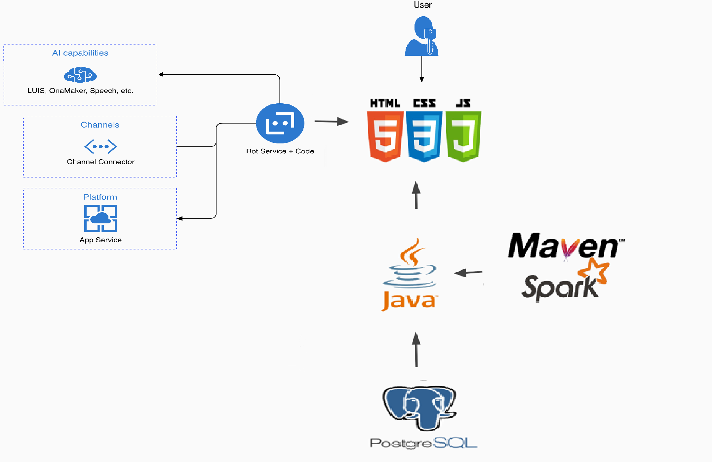
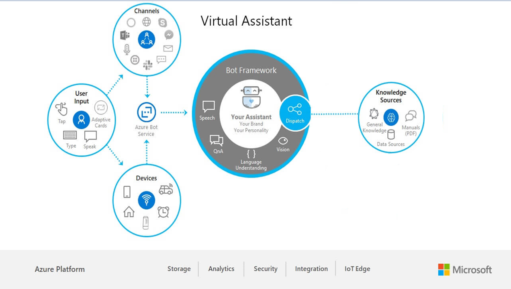
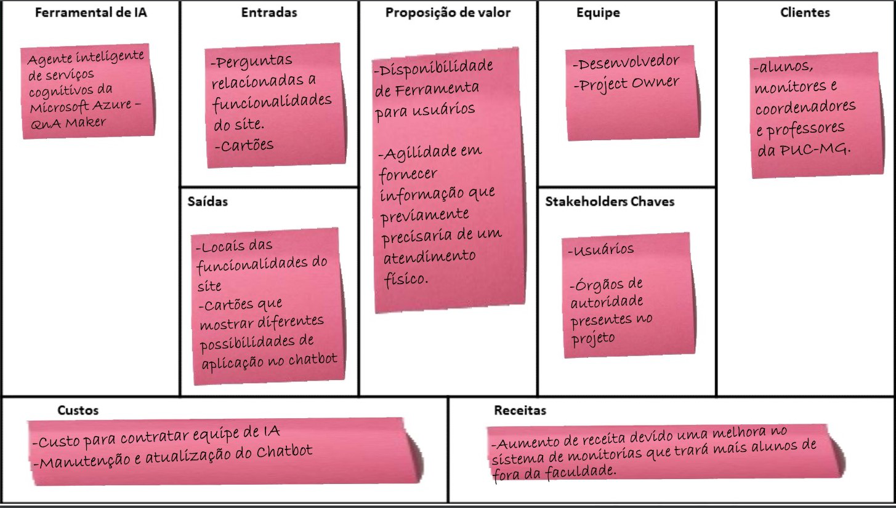
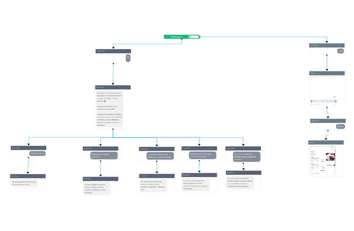
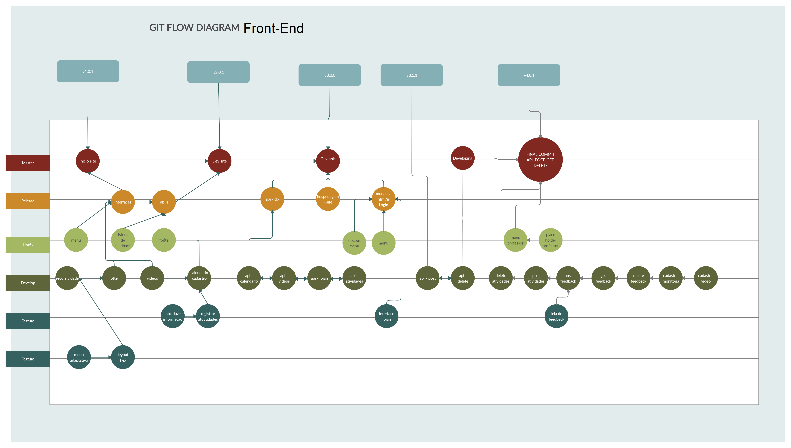
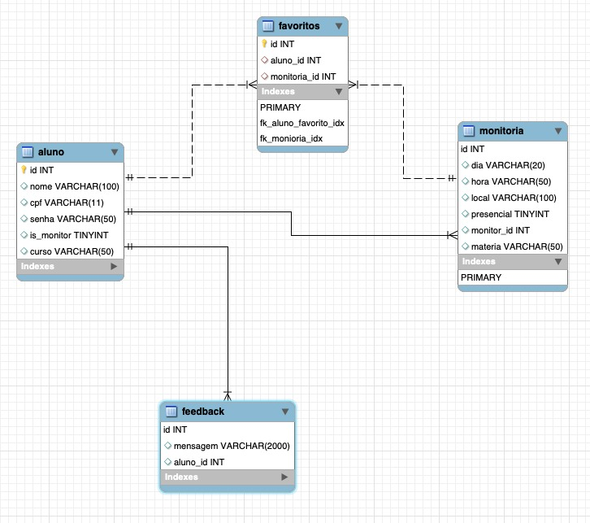

# Problemas de Gerenciamento de Monitorias

**Camilla Vitoria Bueno da Rocha, camillavbueno@gmail.com**

**Diogo Barros de Rezende, email do aluno 2**

**Marcus Navarro Gabrich, marcus_n_g8@hotmail.com**

**Matheus Rangel de Figueiredo, matheusmrf@gmail.com**

**Rodrigo de Oliveira Gomes, rodrigotrabalhos2018@gmail.com**

---

_Curso de Ciência da Computação, Unidade {Praça da Liberdade}_

_Instituto de Informática e Ciências Exatas – Pontifícia Universidade de Minas Gerais (PUC MINAS), Belo Horizonte – MG – Brasil_

---

A idéia do projeto é facilitar/modernizar o serviço de monitorias prestado pela faculdade.
Atravez do site, onde, o aluno poderá ver as monitorias que mais lhe interesarem, marcar presença em quais ele pretende ir,
poder ter acesso à vídeos disponibilizados por monitores e professores relacionados as suas matérias e, se necessário, 
dar um feedback sobre o que está acontecendo, incluindo críticas e opniões. 

---

**1. Introdução**

	1.1 Contextualização
    
O ritmo cotidiano do meio universitário corresponde a uma mudança de realidade para os alunos das instituições. É vigente a necessidade de recursos variados zelando pelo  ensino acadêmico, uma das ferramentas mais importantes são as monitorias: Sistema de aulas opcionais nas quais alunos de alto desempenho dão aulas para estudantes de semestres anteriores. Essa dinâmica mostra-se ineficiente em diferentes cenários: Nos dias em que alunos descumprem o combinado (por exemplo chegando atrasados), nos períodos de provas, nos quais as monitorias ficam muito cheias ou até mesmo quando o próprio monitor não vai a monitoria.
    
	1.2 Problema
    
A definição geral do problema é a qualidade do sistema de monitorias que muitos professores, alunos, monitores e entre outros do serviço de ensino da Puc, tem reclamado, por terem problemas na comunicação, nos horários e na e qualidade das monitorias. Portanto o intuito é criar uma plataforma que seja rápido, fácil e eficiente em solucionar estes problemas.
    
	1.3 Objetivo geral
	
Buscar garantir, por meio de um sistema de gerenciamento, uma maneira mais eficazde organizar as monitorias, com o intuito de que todos os que participam delas, tenham acesso às informações e materiais das mesmas, facilitando a vida, dos monitores e dos alunos, com tabela de horário, e marcações de aulas.

	1.3.1 Objetivos específicos
	
-Capacidade do professor de vizualizar feedback das monitorias.
-Capacidade de vizualizar horarios de monitorias.

 	1.4 Justificativas

Como alunos da PUC Minas, também temos nossas dúvidas e problemas, necessitando, às
vezes, de ajuda das monitorias. Através de pesquisas no Google Forms obtivemos várias
justificativas para nossa ideia.

	100% dos alunos entrevistados dizem que sentem falta de uma forma de gerenciar suas
	monitorias.

	Pelo lado dos monitores 71,4% tem problema ou não recebem material do professor, algo que
	poderia muito ajudar o a monitoria a ser mais efetiva e condizente com a matéria e grau de
	dificuldade do professor

	Não obstante, os professores também são favoráveis à nossa ideia, tendo em vista que 94,4%
	deles teriam interesse em receber um feedback sobre suas aulas, desenvolvimentos dos alunos
	e também quais matérias está causando mais duvidas, para que assim possam melhorar a
	qualidade de suas aulas cada vez mais.

**2. Projeto da Solução**

    2.1. Requisitos funcionais
	
Enumere os requisitos funcionais previstos para a sua aplicação. 
	Use a tabela abaixo para enumerá-lo.  Esses requisitos devem estar 
	de acordo com as definições do modelo de negócio.

| No.           | Descrição                                                               | Prioridade |
|:------------- | :---------------------------------------------------------------------: | ----------:|
| RF-01         | Cadastrar monitorias (Monitor)                                          | Alta       |
| RF-02         | Exibir o catálogo de monitorias disponíveis                             | Alta       |
| RF-03         | Cadastrar usuário                                                       | Alta       |
| RF-04         | Adicionar monitoria em calendário do aluno                              | Média      |
| RF-05         | Acessar os links relevantes as aulas (links complementares de apoio)    | Baixa      |
| RF-06         | Adicionar vídeos (monitores)                                            | Baixa      |
| RF-07         | Sistema de Feedback (aluno)                                             | Baixa      |

	2.2. Tecnologias
	
Ferramentas: Visual Studio Code, Github, Eclipse, PostgreSQL, pgAdmin, Postman, GitHub Desktop, Spark Framework, Maven, Node, Azure, botBuilder.

Linguagens: Html, Css, JavaScript, Git, Java, SQL.

Serviços web: Canvas, Sga (Puc Minas), Remove Background, Color Picker, Automatically
Remove, Adobe Color, Stack Overflow.

A interação do usuário com o Sistema vai ser conduzida de maneira semelhante a um
fórum, basicamente composta de três áreas principais, sendo uma área com um tela de atividades
próprio em relação ao tema, outra em foco a discussões e uma relacionada a feedback.
	

	
As tecnologias básicas de desenvolvimento web - HTML, CSS, JS - serão utilizadas para tornar os dados visíveis aos usuários finais.

A parte de controle da aplicação é feita em Java, com auxilio das tecnologias Spark Framework e Maven integrada, e como ambiente de trabalho foi utilizado a IDE Eclipse.

O modelo da aplicação é feita no banco de dados relacional PostgreSQL, utilizado o dBeaver como ferramenta de administração do Banco de dados

	2.3. Serviços inteligentes
    
A proposta da integração de um sistema inteligente no software é inovadora e de alto potêncial. 
	De maneira simples, as tecnologias que futuramente serão implementadas no  projeto Pucnitorias, tem como objetivo de auxiliar o usuário sem necessitar de um ser humano, em síntese,
	seria a criacao de um chatbot afim de ajudar em tarefas presentes no projeto.
	Dessa maneira, apartir da utilização da tecnologia de inteligência artificial programada para atuar a partir da interação e indentificacao do sentido da "fala" do usuario, 
	será possível gerar resultados imediatos apartir de necessidades evidênciadas durante uma simples conversa ou exigência direta.
	
A possibilidade de ser atendido por um ser humano digitalmente hoje em dia está se tornando cada vez mais escassa.

Uma vez que surgiu a possibilidade de automatização de serviços de atendimentos, empresas passaram a investir sistemas capazes de fazer o mesmo trabalho, por um preço bem mais baixo e, dependendo da situação, até melhor que um humano. Dessa forma muitas empresas que possuem esses serviços estão desenvolvendo seus próprios sistemas inteligentes, de modo a desenvolver seus processos de atendimento em quesitos como personalização, que causa uma maior intimidade com usuário, e diminuir seus gastos.

De acordo com as demandas do mercado e com a evolução de serviços de inteligência artificial, tem se tornado cada vez mais comum a utilização de tecnologias aliadas ao serviços digitais e afins. Dentre tais inovações, um serviço que otimiza o atendimento, o torna mais rápido e ainda pode ser personalizado de acordo com o segmento em que é aplicado, é o Chatbot.

O Chatbot consiste em um serviço de atendimento que, através de inteligência artificial e serviços cognitivos, tenta simular um ser humano em conversas para facilitar a comunicação entre cliente e corporação. Neste projeto, nossa equipe apresentará o desenvolvimento e aplicação de um Chatbot aplicado no trabalho de TI2 relacionado ao tema gerenciamento de monitoria, construído através da ferramenta "Qna Maker" oferecida pela Microsoft Azure.
	

	2.3.1 FERRAMENTAS DE IA
	
A ferramenta de IA utilizada foi o QnA maker, este é um servicode NLP (processamento de idioma natural) baseado em nuvem que permite criar uma camada de conversa sobre seus dados. Ele é usado para encontrar a resposta mais apropriada para qualquer entrada de idioma natural proveniente de KB (base de dados de conhecimento) personalizada de informações.

	2.3.2	ENTRADAS	
As entradas de dados para o Chatbot permeiam perguntas frequentes que o cliente pode ter sobre a localidade de funções do site, como onde clicar para: Sair do site, ver Minhas Atividades, Adicionar monitorias as suas atividades, onde dar Feedback.

	2.3.3	SAIDAS
Se espera que o sistema do ChatBot responda de maneira adequada as perguntas feitas pelo usuário, disponibilizando as informações requisitadas corretamente.
Para questões dos cards, utiliza-se placeholders de modo a demonstrar a capacidade e versatilidade do sistema, podendo gerar diversas propostas de valor ao usuário.

	2.3.4	PROPOSIÇÃO DE VALOR
Como resultado positivo e benéfico ao consumidor do serviço alvo, a implementação do Chatbot trará praticidade para o usuário, o qual pode saciar suas dúvidas sem ter de esperar atendimento humano. Além disso, terá maior disponibilidade e resolução de dúvidas, já que um Chatbot consegue atender inúmeros clientes ao mesmo tempo, o que reduz enormemente o tempo de espera e agiliza a resolução das questões - em detrimento de um funcionário humano, que, em sua maioria, é incapaz de atender a mais de uma pessoa ao mesmo tempo.

	2.3.5	EQUIPE
A equipe contará com a participação do Project Owner do estabelecimento para disponibilizar os dados necessários, como informações relacionados ao sistema, com a equipe de desenvolvimento e construção do Chatbot.

	2.3.6	STAKEHOLDERS CHAVES
Os usuários e o Project owner que são chaves fundamentais para o sucesso do Chatbot, que deve atender ás necessidades de seu serviço.

	2.3.7	CLIENTES
O público alvo: Ambos os gêneros de idade entre 18 e 50 anos com escolaridade superior completa ou cursando, com faixa de renda em torno de 1 a 3 salários médios, classe média até a alta. Localizados ao redor da região central de Belo Horizonte, MG. Sendo os principais: alunos, monitores, coordenadores e professores.

	2.3.8	CUSTOS
O maior custo será atribuído ao contrato de um equipe especializada em IA para desenvolver o Chatbot, além de um custo a longo prazo para a manutenção do mesmo, levando em consideração que os dados podem sofrer alterações devido novas implementação ao sistema. 

	2.3.9	RECEITAS
Vemos em algumas faculdades a precariedade ou até mesmo a ausência de monitoria. Assim, otimizando o nosso sistema, criamos uma melhor visibilidade sobre a faculdade, em como ela opera ajudando os alunos até mesmo fora das salas de aula. Instigando mais e mais pessoa a virem estudar na PUC. Basicamente aumento de receita devido uma melhora no sistema de monitorias que trará mais alunos de fora da faculdade.

	2.3.10	FLUXO DO DIÁLOGO COM A DEFINIÇÃO DAS INTENÇÕES E ENTIDADES

	
Para melhor visualização do esquema, acessar no link: https://app.botmock.com/view/e17458f0-2f7f-11eb-8983-d7bea999eff6

	
	**3. Metodologia**

Apresente o modelo de dados. Defina o dicionário de dados com os respectivos formatos e significados.

	3.1. Ambiente de trabalho

| Ambiente      | Plataforma                               | Link                                                                                  |
| ------------- |:----------------------------------------:| -------------------------------------------------------------------------------------:|
| Repositorio de cod.    |  GitHub                         |  https://github.com/icei-pucminas/ti2-cc-gerenciamento-de-monitoria                   |
|                        |                                 |                                                                                       |
| Doc. do projeto        | Google Drive                    | https://drive.google.com/drive/folders/1XtUdxNorrBLHTvE5zAPeEkjn8qoVq8M?usp=sharing   |
|                        |                                 |                                                                                       |
|                        |                                 | https://marvelapp.com/ed6hi14/ (Telas interativas aluno)                              | 
| Projeto de Interface  e wireframe  | MarvelApp (interativas)         | https://marvelapp.com/66ecg0c (Telas interativas prof)                    |
|                        |                                 | https://marvelapp.com/66igaj2/(Telas app aluno e prof)                                | 
|                        |                                 |                                                                                       |
| Gerenciamento Proj     | Trello                          | https://trello.com/b/DkshmIyL/ti2-cc                                                  |
|                        |                                 |                                                                                       |
| Website projeto        | Heroku                          | https://site-gerenciamento-2-0.herokuapp.com/html/index.html                                                  |

	3.2. Fluxo de Publicação

Com relação à gestão do código fonte, o grupo utiliza um processo baseado no
	GitHub Flow criado pelo próprio GitHub (2011), mostrado na Figura a seguir. Portanto, o
	projeto segue a seguinte convenção para o nome de branchs:
	- master: versão pronta para implementação (deploy).
	- nome-explicativo: versão herdada da master.

Mais informações podem ser encontradas nesse 
[repositório](https://github.com/Warlord006/Estoque/blob/master/docs/4-Gest%C3%A3o-Configura%C3%A7%C3%A3o.md#controle-de-vers%C3%A3o) e nesse 
[link](https://guides.github.com/introduction/flow/).

Seguindo o modelo apresentado acima, a branch master deve estar
	sempre pronta para deploy. Portanto, no momento que os pull-requests para a master são
	confirmados e assinados, o projeto deve ir ao ar na plataforma escolhida para hospedagem.
	
 	3.3. Gerenciamento do Projeto

A equipe se organiza por meio do manuseamento virtual da ferramenta Kanban
	disponibilizada na plataforma Trello e no GitHub Projects. 

Utilizando o metódo Scrum combinado com o Kanban, o grupo foi organizado da seguinte forma:
	- Product Owner: Rodrigo de Oliveira Gomes
	- Scrum Master: Marcus Navarro Gabrich
	- Development Team: Camilla Vitoria Bueno da Rocha, Diogo Barros de Rezende, Matheus Rangel de Figueiredo, 

	**4. Modelagem de dados**

A estrutura do banco de dados basea-se basicamente em dados relacionais, em que sua abstração leva 
em conta os requisitos e as histórias de usuário apresentadas nesse artigo. Abaixo é representado
o diagrama de entidade-relacionamento do sistema, que explica a relação entre os dados e suas abstrações.

  	 4.1. Diagrama de Entidade-Relacionamento

	**5. Avaliação**

O sistema se encontra em estado totalmente funcional, com projetificação futura relacionada a optmização do Front End e desenvolvimento de Sistemas inteligentes. 
	Foi adotado pela equipe uma interface estatica para facilitar as interacoes e consultas efetivadas. 
	Na pagina, o sistema se divide,em pagina de login, no momento em 2 fases como diversos parametros individuais por fase, sendo a fase 1, definida para aluno e fase 2 definida para monitor.
	Na fase 1, a pagina de aluno possui 3 parametros gerais, sendo eles Tela de atividades, Registras Atividades e Feedback. 
	E na fase 2, a pagina do monitor possui 2 parametros gerais, sendo para cadastrar monitoria, e ler feedback.

	**6. Avaliação**

O cenários de testes utilizados na realização dos testes foram (1):Alunos e monitores
	da monitoria em busca de horários e locais destas, (2):Diretoria em busca de informações de
	quão efetivas estão as monitorias, (3):Professores em busca do Sistema de feedback o qual os
	fornece informações sobre as monitorias.

	**7. Conclusão**

Nesse momento, as expectivas são altas. 
	Obtivemos uma boa formação de BackEnd inicialmente que possibilita o a optimização do FrontEnd. 
	O projeto de sistemas inteligentes nessa aplicação tem grande possibilidade de ser efetiva.

	**REFERÊNCIAS**
PlaceHolders

**[1.1]** - _ELMASRI, Ramez; NAVATHE, Sham. **Sistemas de banco de dados**. 7. ed. São Paulo: Pearson, c2019. E-book. ISBN 9788543025001._

**[1.2]** - _COPPIN, Ben. **Inteligência artificial**. Rio de Janeiro, RJ: LTC, c2010. E-book. ISBN 978-85-216-2936-8._

**[1.3]** - _CORMEN, Thomas H. et al. **Algoritmos: teoria e prática**. Rio de Janeiro, RJ: Elsevier, Campus, c2012. xvi, 926 p. ISBN 9788535236996._

**[1.4]** - _SUTHERLAND, Jeffrey Victor. **Scrum: a arte de fazer o dobro do trabalho na metade do tempo**. 2. ed. rev. São Paulo, SP: Leya, 2016. 236, [4] p. ISBN 9788544104514._

**[1.5]** - _RUSSELL, Stuart J.; NORVIG, Peter. **Inteligência artificial**. Rio de Janeiro: Elsevier, c2013. xxi, 988 p. ISBN 9788535237016._
